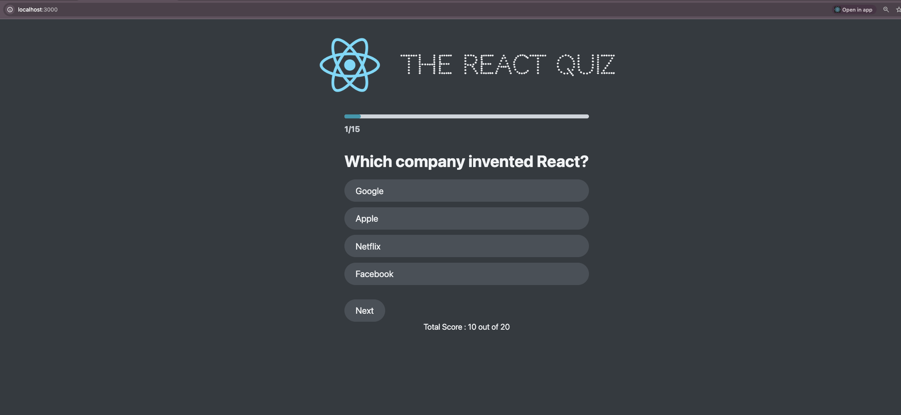

# 🎯 QuizApp

A modern, interactive quiz application built with **React** and powered by **json-server** for a local mock backend.

This app helps users test their knowledge with multiple-choice questions, tracks their score, and displays performance using visual feedback and emoji-based scoring.

---

## 🚀 Features

- ✅ Dynamic question rendering
- ✅ Scoring logic using `useReducer`
- ✅ Local API using `json-server`
- ✅ Responsive and styled using custom CSS
- ✅ Feedback based on performance (with emoji 🏆🥇🤩🤦‍♂️)
- ✅ Retry functionality

---

## 📸 Preview

![QuizApp Preview]


---

## 🛠️ Tech Stack

- [React 19](https://reactjs.org/)
- [json-server](https://github.com/typicode/json-server)
- Vanilla CSS using custom design system
- React DevTools for state debugging
- React Testing Library (optional testing setup)

---

## 📦 Installation & Setup

### 1. Clone the repository

```bash
git clone https://github.com/UtkarshPriy/QuizApp.git
cd QuizApp
```

2. Install dependencies
   bash
   Copy
   Edit
   npm install
3. Start the mock API server
   Make sure your quiz questions are located in data/questions.json.

bash
Copy
Edit
npm run server
This runs json-server at:
📍 http://localhost:8000/questions

4. Start the React app
   In a new terminal window/tab:

bash
Copy
Edit
npm start
The app will be available at:
📍 http://localhost:3000

🧪 Scripts
Script Purpose
npm start Run React app in development
npm run build Build for production
npm run test Run test suite
npm run server Start mock backend (json-server)

### 📁 Project Structure

```
QuizApp/
├── public/
├── src/
│   ├── components/       # Reusable components (Question, Options, Header, etc.)
│   ├── data/             # questions.json for mock API
│   ├── App.js            # Main component
│   ├── index.css         # Custom CSS styles
│   └── ...
├── package.json
└── README.md
```


✨ Contribution
Pull requests and suggestions are welcome!
If you find a bug or want a new feature, feel free to open an issue.

📝 License
This project is licensed under the MIT License.

🙋‍♂️ Author
Made for fun by
🔗 [Utkarsh Priy](https://github.com/UtkarshPriy)
